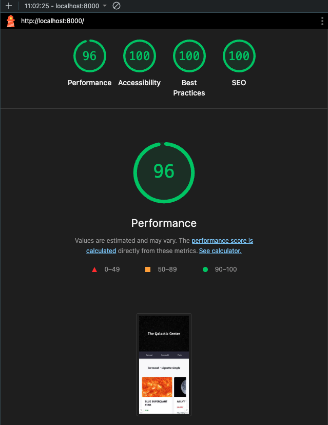
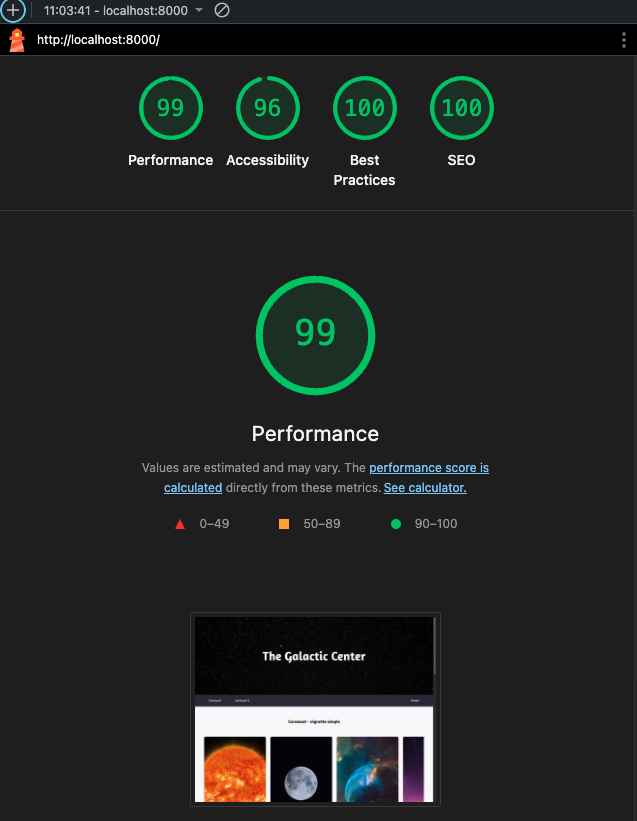

# Instructions

Réalisez la maquette en HTML (responsive serait un plus) en respectant la sémantique, les normes W3C, les règles d'accessibilité et les critères de performance web.

L'utilisation d'une méthodologie CSS est un énorme plus.

Vous pouvez utiliser un préprocesseur CSS, pensez à bien envoyer les fichiers d'avant/après compilation, si tel est le cas.

## En-tête

- le texte doit s'afficher avec la police Amaranth,
- l'image de fond remplit toujours l'espace disponible peu importe la résolution

## Menu

- la navigation reste visible au défilement de la page,
- en cliquant sur les liens du menu, la page défile jusqu'à la zone concernée,
- possibilité de faire une animation pour le changement du lien actif

## Carrousel

- le carrousel comporte plusieurs vignettes, minimum 5, mais libre à vous d'en mettre plus ;)
- le scroll horizontal et vertical n'est pas visible,
- au survol la vignette s'agrandit légèrement,
- les images des vignettes sont en "portrait" en desktop et en "paysage" en mobile,
- on doit pouvoir faire défiler le carrousel

## Pied de page

- pied de page responsive

# Indications

## Typographie

### Texte

- Taille : 16px

### Titre

- Taille : 23px

### Sous-titre

- Taille : 13px

### Police

- Nom de la police : [Amaranth](https://fonts.google.com/specimen/Amaranth)
- Graisse : 400, 700

### Images

- possibilité d'utiliser des banques d'images comme https://unsplash.com/fr

# Synthèse des étapes

## Méthodologie utilisée

- Utilisation de BEM pour la nomenclature des classes CSS
- Utilisation de SASS pour la gestion des variables et des mixins
- Utilisation de ES6 modules pour la gestion des imports et des exports
- Utilisation de Intersection Observer pour le lazy loading des images

## Optimisations appliquées

### 1. Préchargement des ressources critiques (preload)

### 2. Optimisation des fonts Google (font-display: swap)

### 3. Préconnexion aux domaines externes (preconnect)

### 4. Images en locale et optimisées (WebP)

### 5. Attributs width/height sur images

### 6. CSS minifié (SASS)

### 7. JavaScript optimisé (ES6 modules)

### 8. Lazy loading des images (Intersection Observer)

## Optimisations supplémentaires à prévoir

### 1. Service Worker pour cache (caching)

### 2. CDN pour les assets (distribution géographique)

## Score Lighthouse

En mobile :


En desktop :


## Installation et utilisation

### 1. Cloner le projet

```bash
cd Exo2
```

### 2. Compiler le SASS (optionnel si déjà compilé)

```bash
# Installer SASS si nécessaire
npm install -g sass

 # Compiler
sass styles/main.scss styles/main.css

 # Compiler en mode watch (auto-compilation)
sass --watch styles/main.scss styles/main.css
```

### 3. Ouvrir dans le navigateur

```bash
python3 -m http.server 8000
open http://localhost:8000
```
